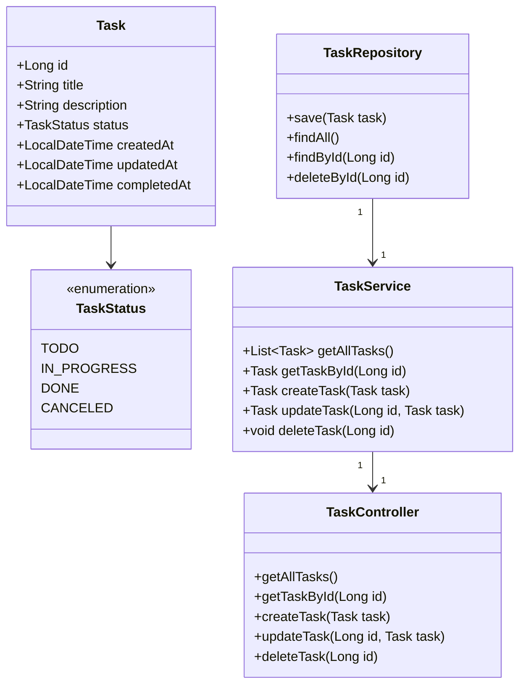

## Projeto para o Bootcamp Dio Decola Tech 2025 - API RESTful - Task Manager
API RESTful para gerenciamento de tarefas, desenvolvida como parte do portfólio.

## Principais Tecnologias

- **Java 17**: Versão LTS mais recente do Java, aproveitando suas melhorias e desempenho otimizado.
- **Spring Boot 3**: Framework que simplifica o desenvolvimento de aplicações Java, oferecendo configuração automática e boas práticas.
- **Spring Data JPA**: Facilita a interação com bancos de dados SQL, abstraindo a camada de persistência de dados.
- **OpenAPI (Swagger)**: Documentação automatizada e interativa para melhor compreensão e uso da API.
- **Railway**: Plataforma de deploy e monitoramento na nuvem, com suporte a PostgreSQL gerenciado e integração com CI/CD.

## Endpoints Principais

- `GET /api/tasks` - Lista todas as tarefas.
- `GET /api/tasks/{id}` - Busca uma tarefa pelo ID.
- `POST /api/tasks` - Cria uma nova tarefa.
- `PUT /api/tasks/{id}` - Atualiza completamente uma tarefa.
- `PATCH /api/tasks/{id}` - Atualiza parcialmente uma tarefa.
- `DELETE /api/tasks/{id}` - Remove uma tarefa.

## Instalação e Execução

1. Clone o repositório:
   ```bash
   git clone https://github.com/matheusmigge/api-rest-dio
   ```
2. Compile e execute o projeto:
   ```bash
   mvn spring-boot:run
   ```

## Documentação da API

A documentação interativa do Swagger/OpenAPI pode ser acessada através de:

Acesso local:
```
http://localhost:8080/swagger-ui.html
```
Deploy no Railway:
```
https://api-rest-dio-production.up.railway.app/swagger-ui/index.html
```

## Contribuição

Contribuições são bem-vindas! Para sugerir melhorias, abra uma issue ou envie um pull request.

---

Diagrama de classes:


