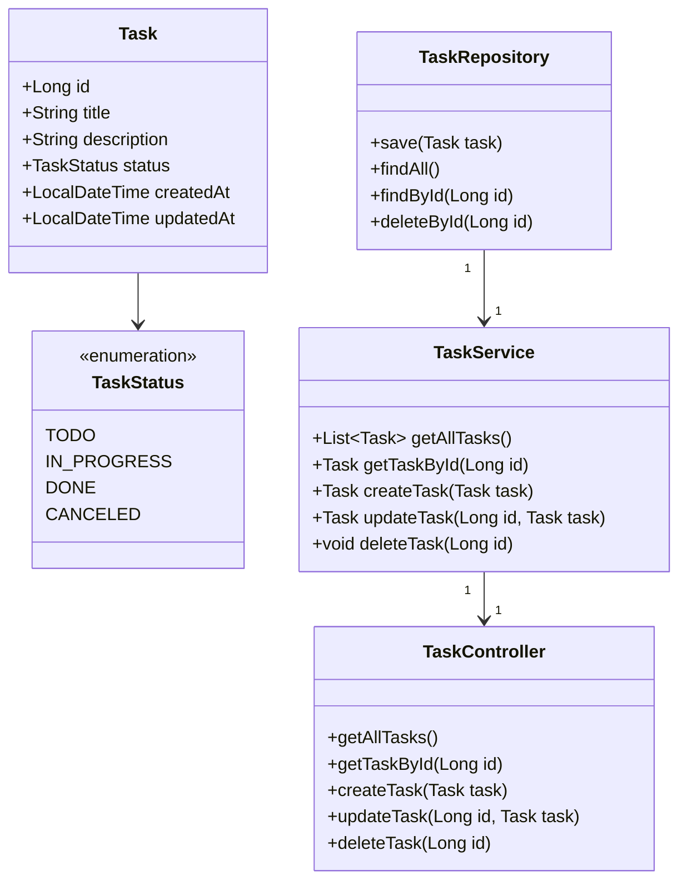

## Projeto para o Bootcamp Dio Decola Tech 2025

Diagrama de classes:

```mermaid

classDiagram
    class Task {
        +Long id
        +String title
        +String description
        +TaskStatus status
        +LocalDateTime createdAt
        +LocalDateTime updatedAt
    }


    class TaskStatus {
        <<enumeration>>
        TODO
        IN_PROGRESS
        DONE
        CANCELED
    }

    class TaskRepository {
        +save(Task task)
        +findAll()
        +findById(Long id)
        +deleteById(Long id)
    }

    class TaskService {
        +List~Task~ getAllTasks()
        +Task getTaskById(Long id)
        +Task createTask(Task task)
        +Task updateTask(Long id, Task task)
        +void deleteTask(Long id)
    }

    class TaskController {
        +getAllTasks()
        +getTaskById(Long id)
        +createTask(Task task)
        +updateTask(Long id, Task task)
        +deleteTask(Long id)
    }

    Task --> TaskStatus
    TaskRepository "1" --> "1" TaskService
    TaskService "1" --> "1" TaskController


```
